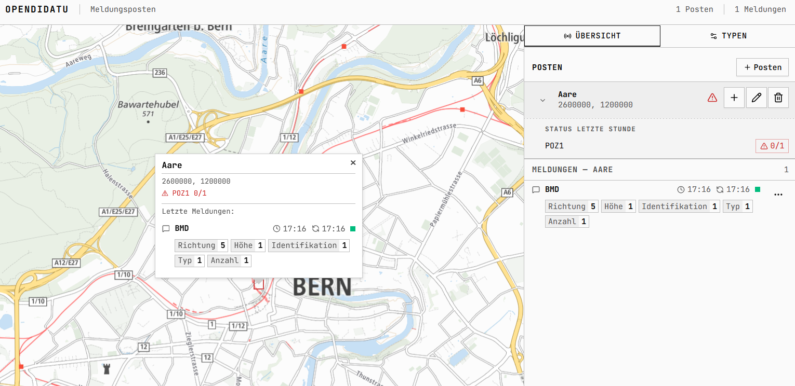

# OPENDIDATU



Tries to be a simple alternative to Didatu, with a focus on ease of use. The main goal is to have something for training purposes until a new full featured application is in place.

## Docker

The project now includes Docker packaging for a published-image workflow.

Pushes to `main` automatically build and publish the Docker image to GitHub Container Registry through [docker-publish.yml](.github/workflows/docker-publish.yml). The published image path is:

```bash
ghcr.io/schickli/opendidatu:latest
```

Build the image locally:

```bash
docker build -t opendidatu:latest .
```

Run it with persistent named volumes for the SQLite database and map assets:

```bash
docker run --name opendidatu -p 3000:3000 -v opendidatu-data:/app/data -v opendidatu-map:/app/map ghcr.io/schickli/opendidatu:latest
```

On first startup, the container bootstrap downloads the map metadata, the map style JSON, the sprite assets, and the mbtiles archive into the mounted map volume. The database file is created automatically in the mounted data volume.

Useful optional runtime variables:

```bash
DATABASE_PATH=/app/data/opendidatu.sqlite
MAP_DATA_DIR=/app/map
MAP_AUTO_DOWNLOAD=true
MAP_MBTILES_URL=https://vectortiles.geo.admin.ch/tiles/ch.swisstopo.base.vt/v1.0.0/ch.swisstopo.base.vt.mbtiles
MAP_TILE_METADATA_URL=https://vectortiles.geo.admin.ch/tiles/ch.swisstopo.base.vt/v1.0.0/tiles.json
MAP_STYLE_PATH=/app/map/style.json
MAP_STYLE_TEMPLATE_URL=https://vectortiles.geo.admin.ch/styles/ch.swisstopo.lightbasemap.vt/style.json
MAP_SPRITE_BASE_URL=https://vectortiles.geo.admin.ch/styles/ch.swisstopo.lightbasemap.vt/sprite/sprite
SEED_SAMPLE_DATA=false
```

Persistence behavior:

- Recreating the container keeps the database as long as `opendidatu-data` is kept.
- The large map download stays out of the image and is reused as long as `opendidatu-map` is kept.
- Set `MAP_AUTO_DOWNLOAD=false` if you want to mount pre-provisioned map files instead of downloading them on first start.

When you are running this service so that other people in the same network can access it, you might want them to be able to access the application under opendidatu.local instead of the IP address. You can achieve that by adding the following line to your hosts file: 
(On Windows, the hosts file is located at `C:\Windows\System32\drivers\etc\hosts`, on Linux and MacOS it's at `/etc/hosts`)

```
127.0.0.1 opendidatu.local
```

Then you can access the application at `http://opendidatu.local:3000`.

## Local Development

Install dependencies and start the app:

```bash
pnpm install
pnpm dev
```

The application is then available at `http://localhost:3000`.

You can also run the download script to fetch the map assets:

```bash
./map/downloadMap.sh
```

## Database

By default, the SQLite database is created at `./data/opendidatu.sqlite`.

You can override that location with:

```bash
DATABASE_PATH=/absolute/path/to/opendidatu.sqlite
```

## Map Assets

The app serves the map style through `/api/map/style`, sprite assets through `/api/map/sprite/sprite(.json|.png|@2x.json|@2x.png)`, and vector tiles through `/api/map/tiles/{z}/{x}/{y}`.

Map assets default to files in `./map`, but can be overridden at runtime:

- `map/demo.mbtiles`
- `map/tiles.json`
- `map/style.json`
- `map/sprite.json`
- `map/sprite.png`
- `map/sprite@2x.json`
- `map/sprite@2x.png`

Relevant environment variables:

```bash
MAP_DATA_DIR=./map
MAP_MBTILES_PATH=./map/demo.mbtiles
MAP_TILE_METADATA_PATH=./map/tiles.json
MAP_STYLE_PATH=./map/style.json
MAP_SPRITE_BASE_URL=https://vectortiles.geo.admin.ch/styles/ch.swisstopo.lightbasemap.vt/sprite/sprite
MAP_AUTO_DOWNLOAD=true
```

## Todo's

- [ ] Add a csv export endpoint for the data
- [ ] Add a GPX import option for additional data on the map
- [ ] Add integration tests for the API endpoints
